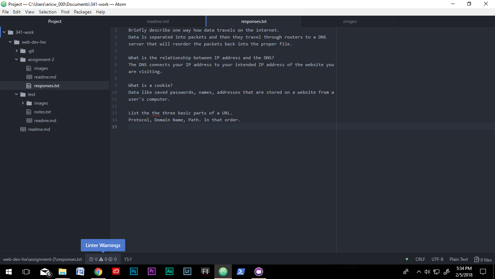

## Assignment 2

A Version Control System like Github is used because it is easy to keep track of
changes that we have made because we have to commit changes and write a short
summary of those changes. It allows the user to revert to previous versions and
see what worked and where, and what didn't work and why. You can also see
changes from other collaborators.

My [response text](./response.txt)

Brief work cycle: I followed along with the online tutorial of
creating and saving directories and files on Github. I created a
new repository, I linked it to my computer. Then I followed the
assignment 2 parameters step by step. 

