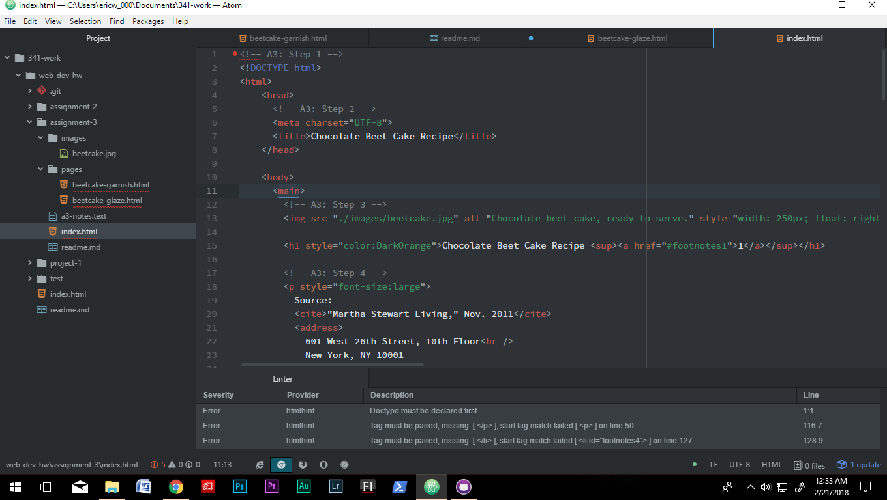

##A3 Readme.md

Each page consists of 1 head element and 1 body element. There can be five elements inside of the head and 2 markup
elements in the body. The head elements(Meta,Viewport,Title,Link and Style) are the thoughts of the page not viewable
to visitors. The body and head is all of the information that will be rendered and displayed by the browser.

Structural markup is the skeleton of the body- things like paragraphs and headings. Semantic markup is all of the
organs- things like bold text and superscript.

My work cycle is pretty consistent. I read all of the website material first and then I follow along the assignment
portion in Atom. I had very few issues. I had to make sure I was superscripting the footnote instances properly. It
really helps to constantly save and preview the website. It also helps to look at notes that are supplied. 

