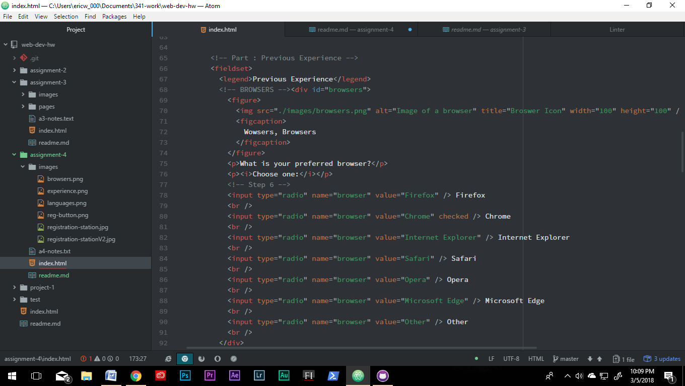

<h1>My Readme.md</h1>
 
Alt text is alternate text atribute. It is used for screen reader software for the visually impared.
 
Login and Passwords are the most common forms I come across. They allow me to access pages like Facebook without me having to re-enter information as well as protecting that information via password encryption.
 
I followed along with the exercise and when I got stumped on the table portion I looked around at other people's tables and was able to fix it some but not all the way quite yet. I am hoping to correct that before the deadline.
 

