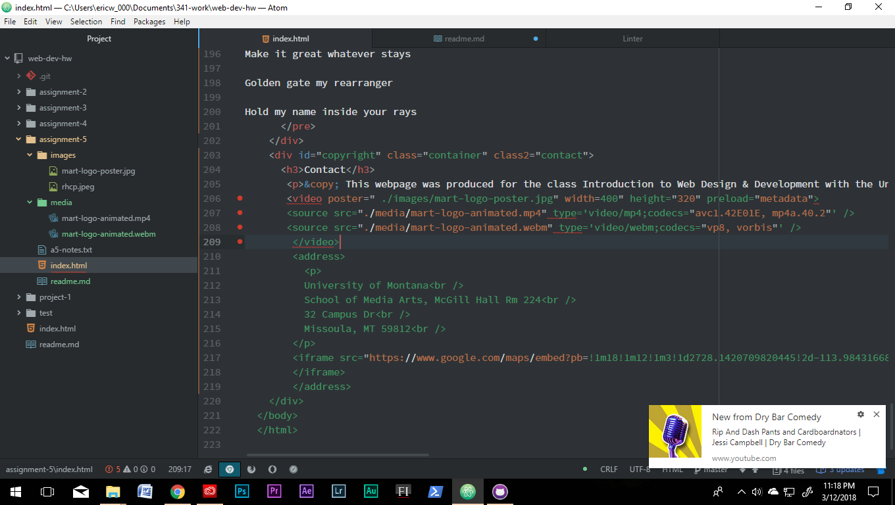

<h1>My A_5 readme.md</h1>
<pre>
Div groups other elements together.
Class groups and identifies similar elements.
ID identifies elements.
Span is the inline equivalent to Div.
</pre>
Third-Party Media Hosting allows you to upload high-quality versions of your work, while the site does all
the heavy lifting, ie: compadability and encoding.

My work cycle was pretty straight forward, I worked alongside the tutorials and prompts. I ran into several
issues regarding my band of choice and sourcable images. I ended up surrendering the band in exchange for
another, only to have similar issues once I reached the audio and video embedding sections. Because YMG owns
the rights to the material, the video will not work on my webpage;however, there is a widget for Youtube
that allows the video to be played there so I decided to keep it as-is, rather than to find a third band. I did not post issues this week but I did compare my code to others' on GitHub.

