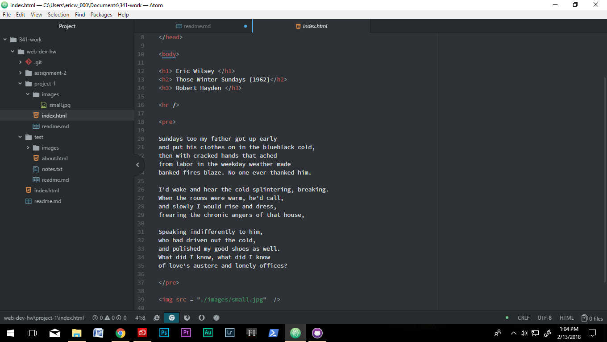

<h1> My Fisrt Webpage Readme.md </h1>

<h2> Browers </h2>
I mainly use Google Chrome on my pc and Safari on my iPad.
Browers allow you to access the internet from your device of choice and then
translates code from web developers into its intended content.

<h2> Wayback Machine </h2>
I visted AOL's snapshot for August 31, 2000. The page is nearly 100% html. The buttons were flat and the graphics
were made from  clip art. It is different from today's AOL where everything is
stylized and contains pictures and movies.

<h2> Work Flow </h2>
I spread this assignment out to last about 3 days.   On day 1:
 I read all of the
source material.   On day 2: I followed along on the course website on how to set
up my root index and test website.  
On day 3: I cleaned up my test website and its
about.me file. Then finished project-1 assignment parameters as well as this readme.md file.

<h2> Workspace </h2>

