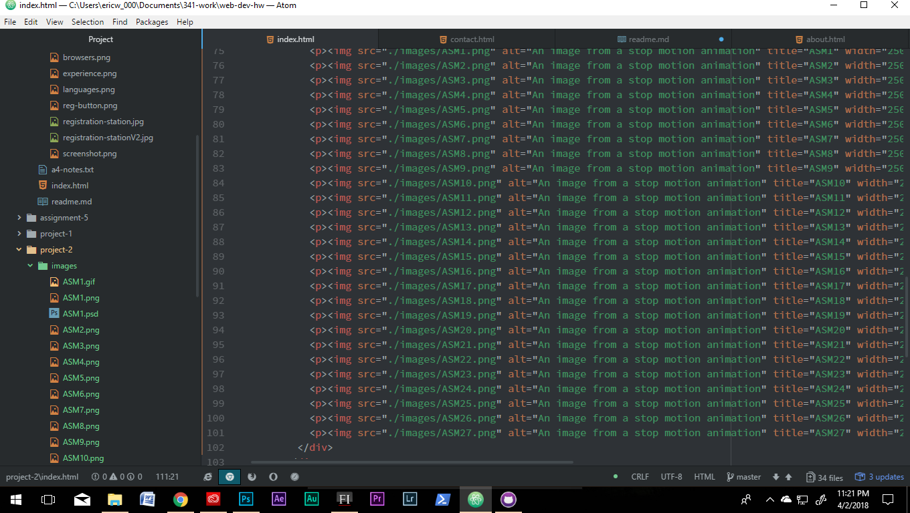

<h1>ASM INSTUCTABLES TECH REPORT</h1>

So far, I am really liking HTML. I learned JS last year with Dr.Musik. I am anxious
to pair the two languages together. I like learning about the tags and functions
of tags. I had trouble with getting my table to show up in a previous assignment,
but thanks to the review from this project, I was able to see where I went wrong-
I had forgotten that specific part of the style element in the head and so it was
not showing up like it was supposed to.

I am very anxious to learn CSS. I cannot wait to make a modern looking webpage.
My sister codes apps, I code JS, HTML, and soon CSS! Bring it on sis..

My work cycle consisted of following the tutorial, referencing the review section
and watching tutorials on YouTube. I started with index, then about and finished with
the contact page. It was pretty straight forward, and although I did not use as many
ids as I could have, I added a ton of other elements, so I think I should be okay.

